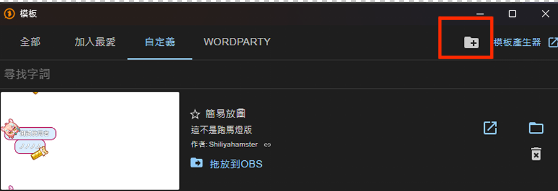
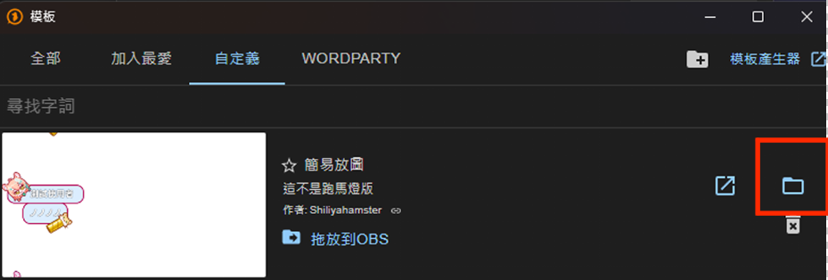

# CSS動畫內容 

- swing 旋轉  
- rgbBorder 邊線RGB 
- rgbColorChange 圖片RGB 


# One comme
## 如果要放自己的圖片的話
開啟軟體，然後打開模板->自訂義->按右上那個資料夾+


把整個資料夾丟進去，打開他

把圖片丟在img資料夾裡面(建議是png/jpg檔)
之後修改css
```
84行改左上的圖
background-image: url('./img/圖片名稱.png');
```
```
146行改右下角的圖
background-image: url('./img/圖片名稱.png');
```