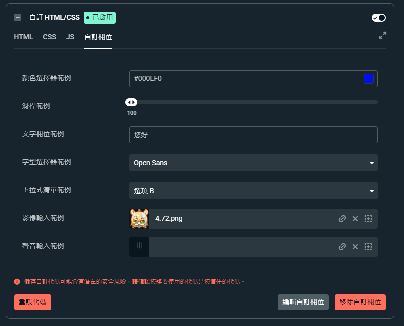
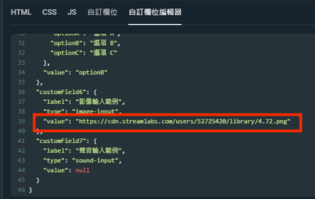
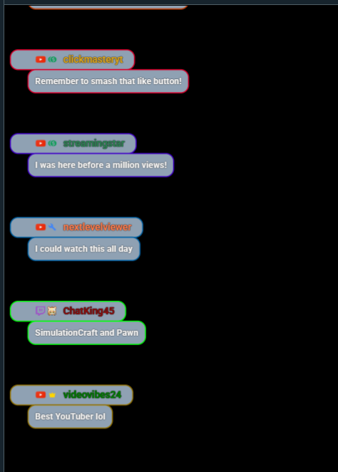

## CSS動畫內容 

- swing 旋轉  
- rgbBorder 邊線RGB 
- rgbColorChange 圖片RGB 


## StreamLab自訂圖片


- 啟用自訂HTML/CSS -> 自訂欄位
- 影像輸入放入想要的圖片
- 之後按下編輯自訂欄位
- 會看到json資料格式，
- 往下拉到customField6.value就會是圖片的url~


## 圖片範例



在CSS background-image: url(''); 裡面貼上圖片url
```
#log .meta::before {
    content: '';
    position: absolute;
    left: -5px; 
    top: -8px;
    width: 50px; 
    height: 50px; 
    background-image: url('https://cdn.streamlabs.com/users/52725420/library/4.72.png'); /*這裡放的是左側的圖片*/
    background-size: contain;
    background-repeat: no-repeat;
    transform: rotate(-45deg);
    z-index: 1;
    animation: rgbColorChange 5s linear infinite; /*動畫效果 RGB*/
}
```


- 這樣圖片就會維持45度角的方式丟進去(?)
- 如果要上傳兩張圖片，就是把原本的圖片改掉
- 然後一樣去JSON拿就好囉